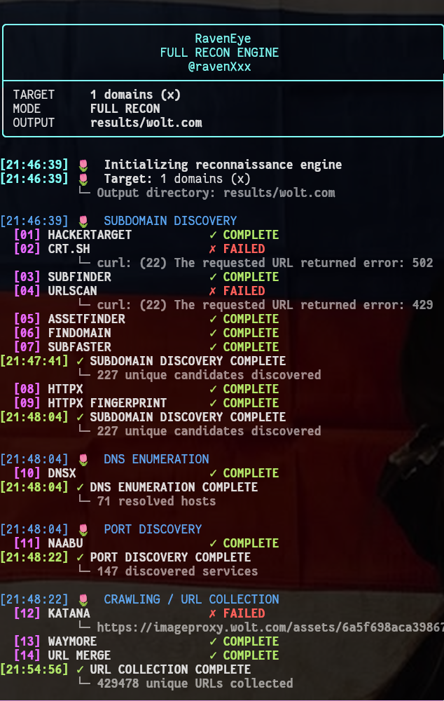

# 🦅 RavenEye

### Full Reconnaissance Engine for Bug Hunters

> **I didn't build RavenEye because there weren't enough recon tools. I built it because I couldn't find a workflow that made sense to me.**

## Why I Created RavenEye

I started learning web security and bug hunting through platforms such as PortSwigger and other security labs.

Those environments were great for learning how vulnerabilities work. I could focus on understanding things like authentication issues, access control, injection, request manipulation, and other web security concepts without having to worry about building a complete reconnaissance pipeline first.

But moving from labs to real-world authorized targets exposed a completely different challenge:

**Reconnaissance.**

Suddenly, before I could even start looking for vulnerabilities, I had to answer questions like:

```text
What subdomains exist?
        ↓
Which ones are alive?
        ↓
Which ones resolve?
        ↓
What technologies are they running?
        ↓
What ports and services are exposed?
        ↓
What URLs exist?
        ↓
What historical URLs exist?
        ↓
What parameters exist?
        ↓
Which assets are actually interesting?
```


And for every step there seemed to be another tool.

Subfinder. Assetfinder. Findomain. DNSX. HTTPX. Naabu. Katana. Waymore. ParamSpider. URLScan. crt.sh...

Then came the blogs, cheat sheets, automation scripts, different methodologies, different opinions about what to enumerate, and different ways of connecting the results together.

I found myself spending more time figuring out **how to perform recon** than actually analyzing the attack surface.

The problem wasn't that the tools were bad.

The problem was that I needed a way to **connect them into a workflow**.

That's why I built **RavenEye**.

---

## 🦅 What RavenEye Is

RavenEye is my attempt to turn a fragmented reconnaissance process into a single, structured pipeline.

Instead of manually jumping from one tool to another:

```text
subdomain tool
      ↓
copy/paste
      ↓
HTTP probing
      ↓
copy/paste
      ↓
DNS
      ↓
copy/paste
      ↓
ports
      ↓
copy/paste
      ↓
crawler
      ↓
copy/paste
      ↓
parameters
      ↓
???
```

RavenEye connects the stages:

```text
                    TARGET
                       │
                       ▼
             SUBDOMAIN DISCOVERY
                       │
                       ▼
                ALIVE FILTERING
                       │
                       ▼
             HTTP FINGERPRINTING
                       │
                       ▼
                DNS RESOLUTION
                       │
                       ▼
                PORT DISCOVERY
                       │
                       ▼
            URL / CONTENT DISCOVERY
                       │
              ┌────────┴────────┐
              ▼                 ▼
            KATANA           WAYMORE
              │                 │
              └────────┬────────┘
                       ▼
                  URL MERGING
                       │
                       ▼
              PARAMETER DISCOVERY
                       │
                       ▼
             CATEGORIZED RESULTS
```

The goal isn't to replace the researcher.

The goal is to make the reconnaissance phase **less fragmented and easier to understand**.

---

## 💡 The Problem RavenEye Is Trying to Solve

When you're learning vulnerabilities in a lab, the interesting part is usually the vulnerability itself.

On a real authorized target, the first challenge can simply be:

> **"Where are all the things I should be looking at?"**

A single domain can lead to hundreds or thousands of assets, URLs, services, technologies, and parameters.

RavenEye is designed to help transform that large and messy dataset into something that can be inspected systematically.

For example:

```text
x.com
│
├── Subdomains
│   ├── alive
│   ├── unresolved
│   └── categorized
│
├── DNS
│   └── resolved hosts
│
├── Technologies
│   └── fingerprinted applications
│
├── Services
│   └── discovered ports
│
├── URLs
│   ├── crawled
│   ├── historical
│   └── merged
│
└── Parameters
    └── discovered parameters
```
That organization is one of the main ideas behind RavenEye.

**Recon shouldn't just collect data. It should make the data easier to reason about.**


**Some guidelines**:

if you got rate limit or bad gateway So you should use proxy or VPN if you have one if not try free vpn like proton.

there's solution for stay fully anonymous and bypass rate limit is using proxychains4 as you can see :

```
proxychains4 -q ./RavenEye.sh.x -l x -full
```
