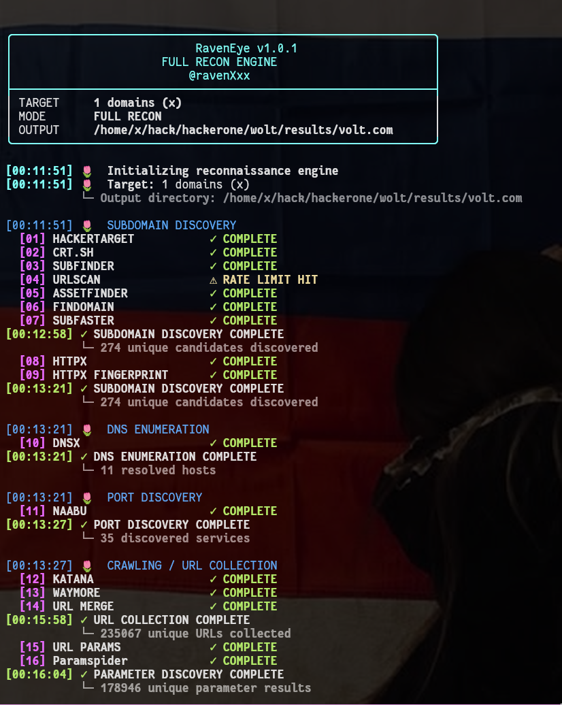
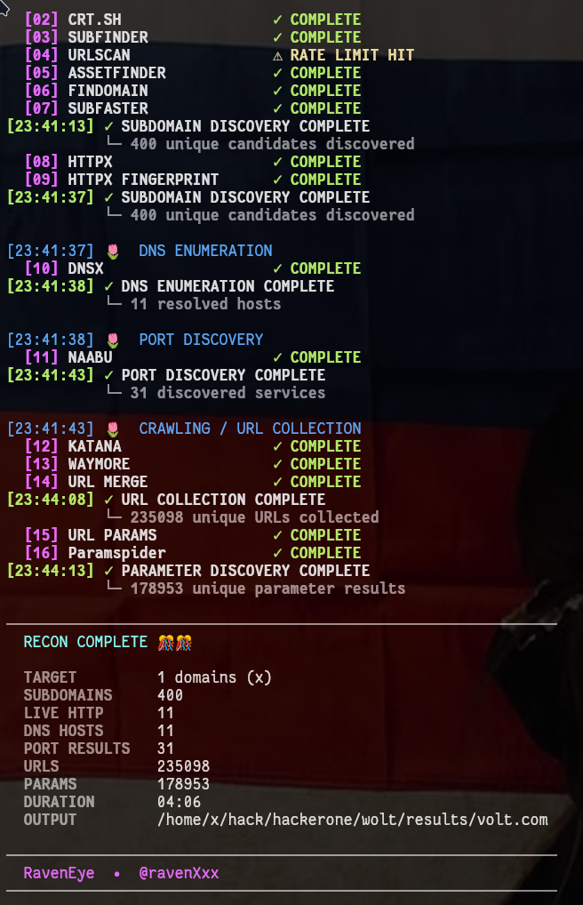

# 🦅 RavenEye

### Automated Reconnaissance Pipeline for Bug Hunters

RavenEye is an all-in-one reconnaissance tool that connects multiple recon stages into a single workflow.

Instead of running many tools manually and moving results between them, RavenEye automates the process and organizes the results for you.

> **Less time managing recon. More time analyzing the target.**

---

## 🔎 What It Does

RavenEye can perform:

* Subdomain discovery
* Alive host detection
* DNS resolution
* HTTP fingerprinting
* Port discovery
* URL discovery
* Crawling
* Historical URL collection
* Parameter discovery
* Result organization

### Workflow

```text
Target
  │
  ├── Subdomains
  ├── Alive Hosts
  ├── DNS
  ├── Technologies
  ├── Ports
  ├── URLs
  │    ├── Crawled
  │    └── Historical
  │
  └── Parameters
```

---

## 🖼️ Screenshots





---
## 📦 Installation

```bash
chmod +x Installer.sh && ./Installer.sh && chmod +x RavenEye.sh
```
---

# 🚀 Usage

RavenEye has two input options:

| Option | Description                       |
| ------ | --------------------------------- |
| `-t`   | Scan a single domain              |
| `-l`   | Scan a list of domains/subdomains |

And two scan modes:

| Mode     | Description             |
| -------- | ----------------------- |
| `-small` | Fast reconnaissance     |
| `-full`  | Complete reconnaissance |

---

### Single Domain

**Small scan:**

```bash
./RavenEye.sh -t target.com -small
```

**Full scan:**

```bash
./RavenEye.sh -t target.com -full
```

---

### Scope List

Use `-l` when you already have a list of **authorized assets** you want RavenEye to scan.

```bash
./RavenEye.sh -l scope.txt -full
```

Example `scope.txt`:

```text
example.com
api.example.com
app.example.com
admin.example.com
```

You can also use:

```bash
./RavenEye.sh -l scope.txt -small
```

With `-l`, RavenEye works with the assets you provide. You don't need to manually fuzz/enumerate the same subdomains beforehand.

---

## ⚡ Small vs Full

### `-small`

Use this when you want quick results.

```text
Subdomain discovery
        ↓
Alive host detection
```

Good for quickly identifying reachable assets.

### `-full`

Runs the complete recon pipeline, including crawling, historical URLs, and parameter discovery.

```text
Subdomains
   ↓
Alive hosts
   ↓
DNS
   ↓
HTTP fingerprinting
   ↓
Ports
   ↓
URLs
   ↓
Parameters
```

A full scan can take **20+ minutes**, depending on the size of the target.

You can usually start reviewing discovered subdomains, DNS results, and alive hosts before the entire scan finishes.

---

## 🌐 Rate Limits / Network Issues

If you encounter rate limits or network errors such as `429` or `502`, you can use a proxy or VPN when appropriate.

For example:

```bash
proxychains4 -q ./RavenEye.sh -l scope.txt -full
```

> A proxy or VPN does not guarantee anonymity or bypass all rate limits.

---

## 🧰 Tools

RavenEye connects several reconnaissance tools and sources, including:

* Subfinder
* Assetfinder
* Findomain
* DNSX
* HTTPX
* Naabu
* Katana
* Waymore
* ParamSpider
* URLScan
* crt.sh

---

## 🦅 Why RavenEye?

I built RavenEye because recon often means jumping between many different tools and manually connecting their results.

RavenEye puts those steps into one workflow:

```text
DISCOVER → VERIFY → ENUMERATE → CRAWL → ANALYZE
```

**Contributions are welcome. Feel free to open a PR.**

**Recon should be a workflow, not a collection of commands.**

---

## ⚠️ Authorization

RavenEye is intended for **authorized security testing only**, such as bug bounty programs, security labs, or systems you own or have permission to test.
